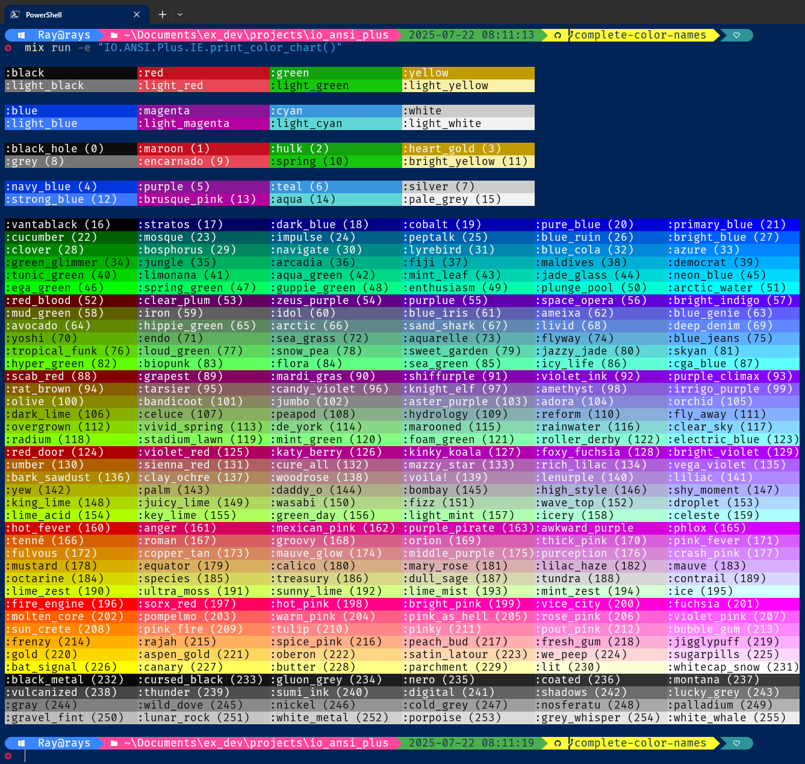

# IO ANSI Plus

Functionality to render ANSI escape sequences.
Clone of module [IO.ANSI][IO.ANSI] but supporting named Xterm colors.

## Installation

Add `io_ansi_plus` to your list of dependencies in `mix.exs`:

```elixir
def deps do
  [
    {:io_ansi_plus, "~> 0.1"}
  ]
end
```

## Notes

In addition to the 16 standard ANSI colors<sup>[1](#footnote1)</sup> and
their background counterparts, this package also supports the 256 Xterm colors
(foreground and background).

All of these 256 colors were given names like:
-  `:aqua`
-  `:chartreuse`
-  `:psychedelic_purple`

For the full list of color names, see the **Color Samples** section below.

You can also use color number atoms instead of specific names:

```elixir
alias IO.ANSI.Plus, as: ANSI
["Hello, ", :color163, "world!"] |> ANSI.format(true) |> IO.puts()
["Hi, ", :color163_background, "world!"] |> ANSI.format(true) |> IO.puts()
```

Any color can have multiple names, for example, `:moccasin` and `:navajo_white`
for color code 223.

For details, see file `config/persist_colors.exs`.

<sup><a name="footnote1">1</a></sup> Actually 8 colors and their "bright" variants.

## Shortcuts

The package also provides shortcuts allowing to drop the `format` calls in the
following expressions:

```elixir
alias IO.ANSI.Plus, as: ANSI
["Hello, ", :brown, "world!"] |> ANSI.format(true) |> IO.puts()
["Hello, ", :purple, "world!"] |> ANSI.format(true) |> IO.write()
[:aqua, "Your move:", :reset, " "] |> ANSI.format(true) |> IO.gets()
```

The above expressions can be respectively shortened to:

```elixir
alias IO.ANSI.Plus, as: ANSI
["Hello, ", :brown, "world!"] |> ANSI.puts(true)
["Hello, ", :purple, "world!"] |> ANSI.write(true)
[:aqua, "Your move:", :reset, " "] |> ANSI.gets(true)
```

## Examples
## 

## Color Chart
## 

```
String.upcase("srgdfgdfgdhdhzfgdgdgDRgdgdfdgdSdgSdfsdfsdfsSgDSDfsdfsdgfsdgSDfsdsdfsdsfdssdfsdsdsdsdsdsdssdsdsdsdsddssdsdsdSDFDS")
```

```

```



## Color Samples
## 
## 

[IO.ANSI]: https://hexdocs.pm/elixir/IO.ANSI.html
