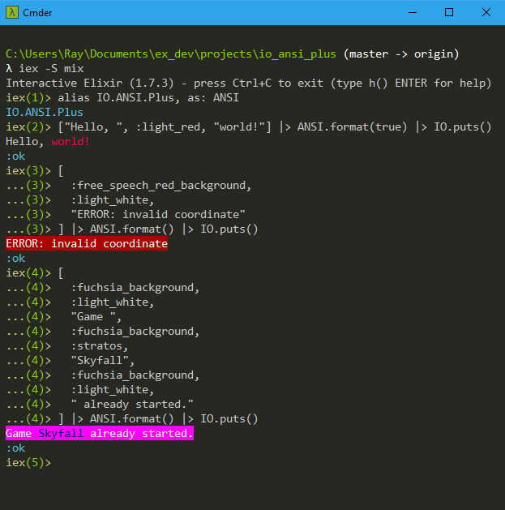
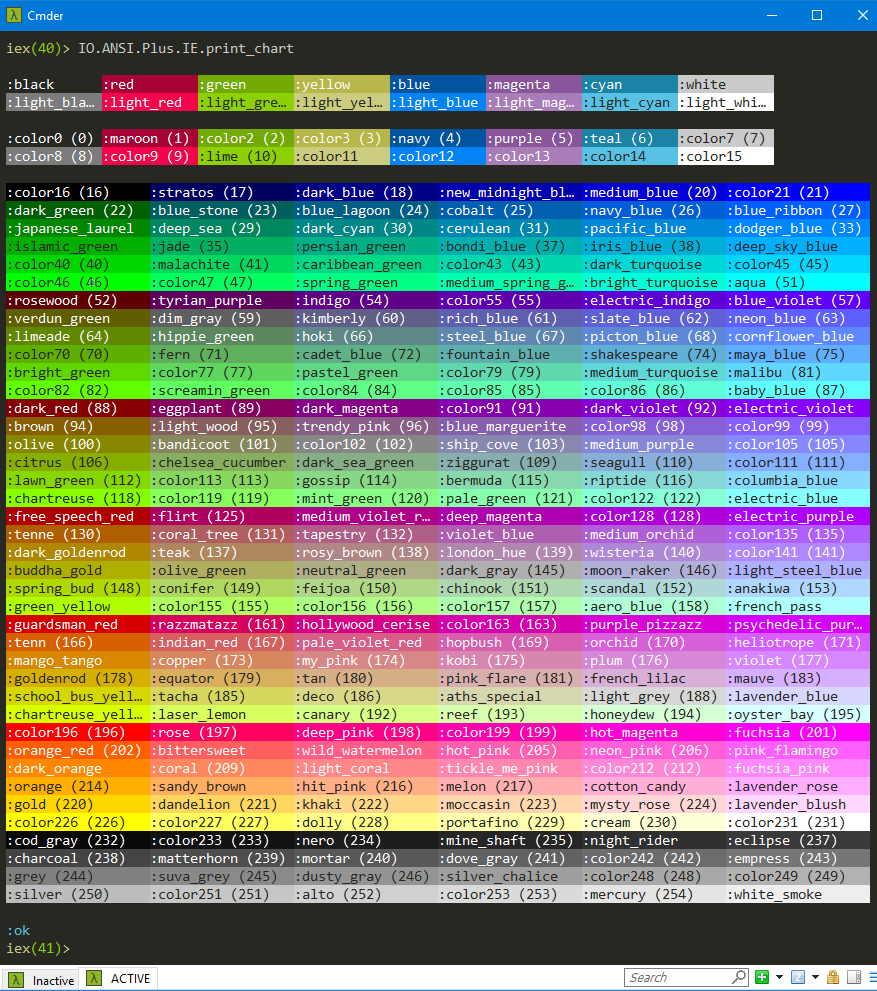

# IO ANSI Plus

[](https://travis-ci.org/RaymondLoranger/io_ansi_plus)

Functionality to render ANSI escape sequences.
Clone of module `IO.ANSI` but supporting named Xterm colors.

## Installation

Add `io_ansi_plus` to your list of dependencies in `mix.exs`:

```elixir
def deps do
  [
    {:io_ansi_plus, "~> 0.1"}
  ]
end
```

## Notes

In addition to the 16 regular ANSI colors<sup>[*](#footnote1)</sup> and
their background counterparts, this package also supports the 256 Xterm colors
(foreground and background).

Most of these 256 colors were given names like:
- `:aqua`
- `:chartreuse`
- `:psychedelic_purple`

You can use color number atoms for the few colors that are unnamed:

```elixir
alias IO.ANSI.Plus, as: ANSI
["Hello, ", :color163, "world!"] |> ANSI.format(true) |> IO.puts()
["Hello, ", :color163_background, "world!"] |> ANSI.format(true) |> IO.puts()
```

Any color can have multiple names, for example, `:moccasin` and `:navajo_white`.

For details, see file `config/persist_colors.exs`.

<sup><a name="footnote1">*</a></sup> Actually 8 colors and their "bright" variants.

## Customization

You can specify new color names by changing file `config/persist_colors.exs`.
<br>You would then need to run `mix deps.compile io_ansi_plus [--force]`
to make the changes effective.

## Shortcuts

The package also provides shortcuts to drop the `format` calls in the following
expressions:

```elixir
alias IO.ANSI.Plus, as: ANSI
["Hello, ", :brown, "world!"] |> ANSI.format(true) |> IO.puts()
["Hello, ", :purple, "world!"] |> ANSI.format(true) |> IO.write()
[:aqua, "Garry, your move:", :reset, " "] |> ANSI.format(true) |> IO.gets()
```

The above expressions can be respectively shortened to:

```elixir
alias IO.ANSI.Plus, as: ANSI
["Hello, ", :brown, "world!"] |> ANSI.puts(true)
["Hello, ", :purple, "world!"] |> ANSI.write(true)
[:aqua, "Garry, your move:", :reset, " "] |> ANSI.gets(true)
```

## Examples
## 

## Color Chart
## 

## Color Samples
- `:color0` (0)
- `:maroon` (1)
- `:color2` (2)
- `:color3` (3)
- `:navy` (4)
- `:purple` `:fresh_eggplant` (5)
- `:teal` (6)
- `:color7` (7)
- `:color8` (8)
- `:color9` (9)
- `:lime` (10)
- `:color11` (11)
- `:color12` (12)
- `:color13` (13)
- `:color14` (14)
- `:color15` (15)
- `:color16` (16)
- `:stratos` (17)
- `:dark_blue` (18)
- `:new_midnight_blue` (19)
- `:medium_blue` (20)
- `:color21` (21)
- `:dark_green` `:camarone` (22)
- `:blue_stone` `:dark_slate_gray` `:mosque` (23)
- `:blue_lagoon` `:orient` (24)
- `:cobalt` `:endeavour` (25)
- `:navy_blue` `:science_blue` (26)
- `:blue_ribbon` (27)
- `:japanese_laurel` (28)
- `:deep_sea` `:observatory` (29)
- `:dark_cyan` (30)
- `:cerulean` (31)
- `:pacific_blue` (32)
- `:dodger_blue` (33)
- `:islamic_green` (34)
- `:jade` (35)
- `:persian_green` (36)
- `:bondi_blue` `:light_sea_green` (37)
- `:iris_blue` (38)
- `:deep_sky_blue` (39)
- `:color40` (40)
- `:malachite` (41)
- `:caribbean_green` (42)
- `:color43` (43)
- `:dark_turquoise` (44)
- `:color45` (45)
- `:color46` (46)
- `:color47` (47)
- `:spring_green` (48)
- `:medium_spring_green` (49)
- `:bright_turquoise` (50)
- `:aqua` (51)
- `:rosewood` (52)
- `:tyrian_purple` (53)
- `:indigo` (54)
- `:color55` (55)
- `:electric_indigo` (56)
- `:blue_violet` (57)
- `:verdun_green` (58)
- `:dim_gray` (59)
- `:kimberly` (60)
- `:rich_blue` (61)
- `:slate_blue` (62)
- `:neon_blue` `:royal_blue` (63)
- `:limeade` (64)
- `:hippie_green` (65)
- `:hoki` (66)
- `:steel_blue` `:air_force_blue` (67)
- `:picton_blue` (68)
- `:cornflower_blue` `:light_slate_blue` (69)
- `:color70` (70)
- `:fern` (71)
- `:cadet_blue` `:keppel` (72)
- `:fountain_blue` (73)
- `:shakespeare` (74)
- `:maya_blue` (75)
- `:bright_green` (76)
- `:color77` (77)
- `:pastel_green` (78)
- `:color79` (79)
- `:medium_turquoise` (80)
- `:malibu` (81)
- `:color82` (82)
- `:screamin_green` (83)
- `:color84` (84)
- `:color85` (85)
- `:color86` (86)
- `:baby_blue` (87)
- `:dark_red` (88)
- `:eggplant` (89)
- `:dark_magenta` (90)
- `:color91` (91)
- `:dark_violet` (92)
- `:electric_violet` (93)
- `:brown` (94)
- `:light_wood` (95)
- `:trendy_pink` (96)
- `:blue_marguerite` (97)
- `:color98` (98)
- `:color99` (99)
- `:olive` (100)
- `:bandicoot` (101)
- `:color102` (102)
- `:ship_cove` `:light_slate_grey` (103)
- `:medium_purple` `:portage` (104)
- `:color105` (105)
- `:citrus` (106)
- `:chelsea_cucumber` (107)
- `:dark_sea_green` (108)
- `:ziggurat` (109)
- `:seagull` (110)
- `:color111` (111)
- `:lawn_green` (112)
- `:color113` (113)
- `:gossip` (114)
- `:bermuda` (115)
- `:riptide` (116)
- `:columbia_blue` (117)
- `:chartreuse` (118)
- `:color119` (119)
- `:mint_green` (120)
- `:pale_green` (121)
- `:color122` (122)
- `:electric_blue` (123)
- `:free_speech_red` (124)
- `:flirt` (125)
- `:medium_violet_red` (126)
- `:deep_magenta` (127)
- `:color128` (128)
- `:electric_purple` (129)
- `:tenne` `:rose_of_sharon` (130)
- `:coral_tree` (131)
- `:tapestry` (132)
- `:violet_blue` (133)
- `:medium_orchid` (134)
- `:color135` (135)
- `:dark_goldenrod` (136)
- `:teak` (137)
- `:rosy_brown` `:thatch` (138)
- `:london_hue` (139)
- `:wisteria` (140)
- `:color141` (141)
- `:buddha_gold` (142)
- `:olive_green` `:dark_khaki` (143)
- `:neutral_green` (144)
- `:dark_gray` (145)
- `:moon_raker` (146)
- `:light_steel_blue` (147)
- `:spring_bud` (148)
- `:conifer` (149)
- `:feijoa` (150)
- `:chinook` (151)
- `:scandal` (152)
- `:anakiwa` (153)
- `:green_yellow` (154)
- `:color155` (155)
- `:color156` (156)
- `:color157` (157)
- `:aero_blue` (158)
- `:french_pass` (159)
- `:guardsman_red` (160)
- `:razzmatazz` (161)
- `:hollywood_cerise` (162)
- `:color163` (163)
- `:purple_pizzazz` (164)
- `:psychedelic_purple` (165)
- `:tenn` (166)
- `:indian_red` `:roman` (167)
- `:pale_violet_red` (168)
- `:hopbush` (169)
- `:orchid` (170)
- `:heliotrope` (171)
- `:mango_tango` `:chocolate` (172)
- `:copper` (173)
- `:my_pink` (174)
- `:kobi` (175)
- `:plum` (176)
- `:violet` (177)
- `:goldenrod` `:golden_poppy` `:corn` (178)
- `:equator` (179)
- `:tan` `:calico` (180)
- `:pink_flare` (181)
- `:french_lilac` (182)
- `:mauve` (183)
- `:school_bus_yellow` (184)
- `:tacha` (185)
- `:deco` (186)
- `:aths_special` (187)
- `:light_grey` `:light_gray` (188)
- `:lavender_blue` (189)
- `:chartreuse_yellow` (190)
- `:laser_lemon` (191)
- `:canary` (192)
- `:reef` (193)
- `:honeydew` `:beige` (194)
- `:oyster_bay` (195)
- `:color196` (196)
- `:rose` (197)
- `:deep_pink` (198)
- `:color199` (199)
- `:hot_magenta` (200)
- `:fuchsia` (201)
- `:orange_red` `:safety_orange` (202)
- `:bittersweet` (203)
- `:wild_watermelon` (204)
- `:hot_pink` (205)
- `:neon_pink` (206)
- `:pink_flamingo` (207)
- `:dark_orange` (208)
- `:coral` (209)
- `:light_coral` `:mona_lisa` (210)
- `:tickle_me_pink` (211)
- `:color212` (212)
- `:fuchsia_pink` (213)
- `:orange` (214)
- `:sandy_brown` `:rajah` (215)
- `:hit_pink` `:macaroni_and_cheese` (216)
- `:melon` (217)
- `:cotton_candy` (218)
- `:lavender_rose` (219)
- `:gold` (220)
- `:dandelion` (221)
- `:khaki` `:salomie` (222)
- `:moccasin` `:navajo_white` (223)
- `:mysty_rose` (224)
- `:lavender_blush` (225)
- `:color226` (226)
- `:color227` (227)
- `:dolly` (228)
- `:portafino` (229)
- `:cream` `:cumulus` (230)
- `:color231` (231)
- `:cod_gray` (232)
- `:color233` (233)
- `:nero` (234)
- `:mine_shaft` (235)
- `:night_rider` (236)
- `:eclipse` (237)
- `:charcoal` `:tundora` (238)
- `:matterhorn` (239)
- `:mortar` `:scorpion` (240)
- `:dove_gray` (241)
- `:color242` (242)
- `:empress` (243)
- `:grey` `:gray` (244)
- `:suva_grey` (245)
- `:dusty_gray` (246)
- `:silver_chalice` (247)
- `:color248` (248)
- `:color249` (249)
- `:silver` (250)
- `:color251` (251)
- `:alto` (252)
- `:color253` (253)
- `:mercury` `:gainsboro` (254)
- `:white_smoke` `:gallery` (255)
