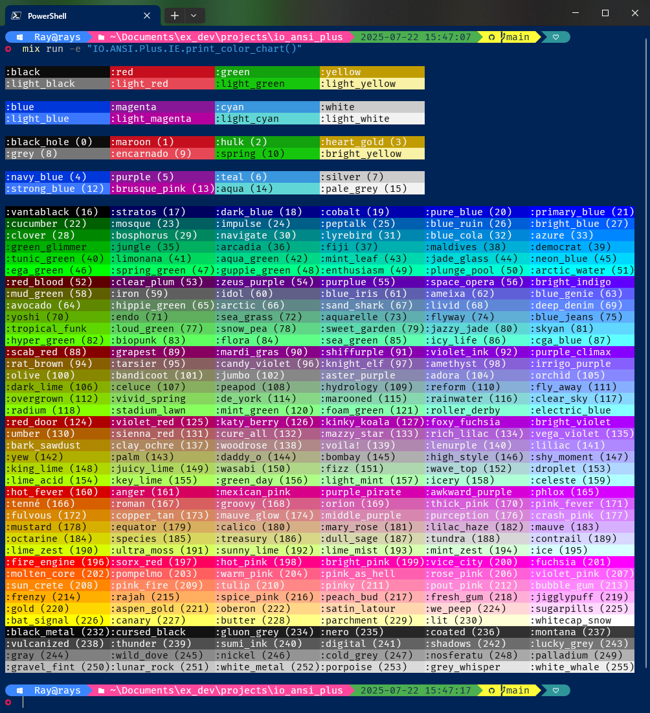

# IO ANSI Plus

[](https://travis-ci.org/RaymondLoranger/io_ansi_plus)

Functionality to render ANSI escape sequences.
Clone of [IO.ANSI][IO.ANSI] but supporting named Xterm colors.

## Installation

Add `io_ansi_plus` to your list of dependencies in `mix.exs`:

```elixir
def deps do
  [
    {:io_ansi_plus, "~> 0.1"}
  ]
end
```

## Notes

In addition to the 16 standard ANSI colors<sup>[1](#footnote1)</sup> and
their background counterparts, this package also supports the 256 Xterm colors
(foreground and background).

Most of these 256 colors were given names like:
-  `:aqua`
-  `:chartreuse`
-  `:psychedelic_purple`

For the full list of color names, see the **Color Samples** section below.

You can use color number atoms for the few colors that are unnamed:

```elixir
alias IO.ANSI.Plus, as: ANSI
["Hello, ", :color163, "world!"] |> ANSI.format(true) |> IO.puts()
["Hello, ", :color163_background, "world!"] |> ANSI.format(true) |> IO.puts()
```

Any color can have multiple names, for example, `:moccasin` and `:navajo_white` for color code 223.

For details, see file `config/persist_colors.exs`.

<sup><a name="footnote1">1</a></sup> Actually 8 colors and their "bright" variants.

## Shortcuts

The package also provides shortcuts to drop the `format` calls in the following
expressions:

```elixir
alias IO.ANSI.Plus, as: ANSI
["Hello, ", :brown, "world!"] |> ANSI.format(true) |> IO.puts()
["Hello, ", :purple, "world!"] |> ANSI.format(true) |> IO.write()
[:aqua, "Garry, your move:", :reset, " "] |> ANSI.format(true) |> IO.gets()
```

The above expressions can be respectively shortened to:

```elixir
alias IO.ANSI.Plus, as: ANSI
["Hello, ", :brown, "world!"] |> ANSI.puts(true)
["Hello, ", :purple, "world!"] |> ANSI.write(true)
[:aqua, "Garry, your move:", :reset, " "] |> ANSI.gets(true)
```

## Examples
## 

## Color Chart
## 

## Color Samples
-  `:black` (0)
-  `:red` `:maroon` (1)
-  `:green` (2)
-  `:yellow` (3)
-  `:blue` `:navy` (4)
-  `:magenta` `:purple` `:fresh_eggplant` (5)
-  `:cyan` `:teal` (6)
-  `:white` (7)
-  `:light_black` (8)
-  `:light_red` (9)
-  `:light_green` `:lime` (10)
-  `:light_yellow` (11)
-  `:light_blue` (12)
-  `:light_magenta` (13)
-  `:light_cyan` (14)
-  `:light_white` (15)
-  `:color16` (16)
-  `:stratos` (17)
-  `:dark_blue` (18)
-  `:new_midnight_blue` (19)
-  `:medium_blue` (20)
-  `:color21` (21)
-  `:dark_green` `:camarone` (22)
-  `:blue_stone` `:dark_slate_gray` `:mosque` (23)
-  `:blue_lagoon` `:orient` (24)
-  `:cobalt` `:endeavour` (25)
-  `:navy_blue` `:science_blue` (26)
-  `:blue_ribbon` (27)
-  `:japanese_laurel` (28)
-  `:deep_sea` `:observatory` (29)
-  `:dark_cyan` (30)
-  `:cerulean` (31)
-  `:pacific_blue` (32)
-  `:dodger_blue` (33)
-  `:islamic_green` (34)
-  `:jade` (35)
-  `:persian_green` (36)
-  `:bondi_blue` `:light_sea_green` (37)
-  `:iris_blue` (38)
-  `:deep_sky_blue` (39)
-  `:color40` (40)
-  `:malachite` (41)
-  `:caribbean_green` (42)
-  `:color43` (43)
-  `:dark_turquoise` (44)
-  `:color45` (45)
-  `:color46` (46)
-  `:color47` (47)
-  `:spring_green` (48)
-  `:medium_spring_green` (49)
-  `:bright_turquoise` (50)
-  `:aqua` (51)
-  `:rosewood` (52)
-  `:tyrian_purple` (53)
-  `:indigo` (54)
-  `:color55` (55)
-  `:electric_indigo` (56)
-  `:blue_violet` (57)
-  `:verdun_green` (58)
-  `:dim_gray` (59)
-  `:kimberly` (60)
-  `:rich_blue` (61)
-  `:slate_blue` (62)
-  `:neon_blue` `:royal_blue` (63)
-  `:limeade` (64)
-  `:hippie_green` (65)
-  `:hoki` (66)
-  `:steel_blue` `:air_force_blue` (67)
-  `:picton_blue` (68)
-  `:cornflower_blue` `:light_slate_blue` (69)
-  `:color70` (70)
-  `:fern` (71)
-  `:cadet_blue` `:keppel` (72)
-  `:fountain_blue` (73)
-  `:shakespeare` (74)
-  `:maya_blue` (75)
-  `:bright_green` (76)
-  `:color77` (77)
-  `:pastel_green` (78)
-  `:color79` (79)
-  `:medium_turquoise` (80)
-  `:malibu` (81)
-  `:color82` (82)
-  `:screamin_green` (83)
-  `:color84` (84)
-  `:color85` (85)
-  `:color86` (86)
-  `:baby_blue` (87)
-  `:dark_red` (88)
-  `:eggplant` (89)
-  `:dark_magenta` (90)
-  `:color91` (91)
-  `:dark_violet` (92)
-  `:electric_violet` (93)
-  `:brown` (94)
-  `:light_wood` (95)
-  `:trendy_pink` (96)
-  `:blue_marguerite` (97)
-  `:color98` (98)
-  `:color99` (99)
-  `:olive` (100)
-  `:bandicoot` (101)
-  `:color102` (102)
-  `:ship_cove` `:light_slate_grey` (103)
-  `:medium_purple` `:portage` (104)
-  `:color105` (105)
-  `:citrus` (106)
-  `:chelsea_cucumber` (107)
-  `:dark_sea_green` (108)
-  `:ziggurat` (109)
-  `:seagull` (110)
-  `:color111` (111)
-  `:lawn_green` (112)
-  `:color113` (113)
-  `:gossip` (114)
-  `:bermuda` (115)
-  `:riptide` (116)
-  `:columbia_blue` (117)
-  `:chartreuse` (118)
-  `:color119` (119)
-  `:mint_green` (120)
-  `:pale_green` (121)
-  `:color122` (122)
-  `:electric_blue` (123)
-  `:free_speech_red` (124)
-  `:flirt` (125)
-  `:medium_violet_red` (126)
-  `:deep_magenta` (127)
-  `:color128` (128)
-  `:electric_purple` (129)
-  `:tenne` `:rose_of_sharon` (130)
-  `:coral_tree` (131)
-  `:tapestry` (132)
-  `:violet_blue` (133)
-  `:medium_orchid` (134)
-  `:color135` (135)
-  `:dark_goldenrod` (136)
-  `:teak` (137)
-  `:rosy_brown` `:thatch` (138)
-  `:london_hue` (139)
-  `:wisteria` (140)
-  `:color141` (141)
-  `:buddha_gold` (142)
-  `:olive_green` `:dark_khaki` (143)
-  `:neutral_green` (144)
-  `:dark_gray` (145)
-  `:moon_raker` (146)
-  `:light_steel_blue` (147)
-  `:spring_bud` (148)
-  `:conifer` (149)
-  `:feijoa` (150)
-  `:chinook` (151)
-  `:scandal` (152)
-  `:anakiwa` (153)
-  `:green_yellow` (154)
-  `:color155` (155)
-  `:color156` (156)
-  `:color157` (157)
-  `:aero_blue` (158)
-  `:french_pass` (159)
-  `:guardsman_red` (160)
-  `:razzmatazz` (161)
-  `:hollywood_cerise` (162)
-  `:color163` (163)
-  `:purple_pizzazz` (164)
-  `:psychedelic_purple` (165)
-  `:tenn` (166)
-  `:indian_red` `:roman` (167)
-  `:pale_violet_red` (168)
-  `:hopbush` (169)
-  `:orchid` (170)
-  `:heliotrope` (171)
-  `:mango_tango` `:chocolate` (172)
-  `:copper` (173)
-  `:my_pink` (174)
-  `:kobi` (175)
-  `:plum` (176)
-  `:violet` (177)
-  `:goldenrod` `:golden_poppy` `:corn` (178)
-  `:equator` (179)
-  `:tan` `:calico` (180)
-  `:pink_flare` (181)
-  `:french_lilac` (182)
-  `:mauve` (183)
-  `:school_bus_yellow` (184)
-  `:tacha` (185)
-  `:deco` (186)
-  `:aths_special` (187)
-  `:light_grey` `:light_gray` (188)
-  `:lavender_blue` (189)
-  `:chartreuse_yellow` (190)
-  `:laser_lemon` (191)
-  `:canary` (192)
-  `:reef` (193)
-  `:honeydew` `:beige` (194)
-  `:oyster_bay` (195)
-  `:color196` (196)
-  `:rose` (197)
-  `:deep_pink` (198)
-  `:color199` (199)
-  `:hot_magenta` (200)
-  `:fuchsia` (201)
-  `:orange_red` `:safety_orange` (202)
-  `:bittersweet` (203)
-  `:wild_watermelon` (204)
-  `:hot_pink` (205)
-  `:neon_pink` (206)
-  `:pink_flamingo` (207)
-  `:dark_orange` (208)
-  `:coral` (209)
-  `:light_coral` `:mona_lisa` (210)
-  `:tickle_me_pink` (211)
-  `:color212` (212)
-  `:fuchsia_pink` (213)
-  `:orange` (214)
-  `:sandy_brown` `:rajah` (215)
-  `:hit_pink` `:macaroni_and_cheese` (216)
-  `:melon` (217)
-  `:cotton_candy` (218)
-  `:lavender_rose` (219)
-  `:gold` (220)
-  `:dandelion` (221)
-  `:khaki` `:salomie` (222)
-  `:moccasin` `:navajo_white` (223)
-  `:mysty_rose` (224)
-  `:lavender_blush` (225)
-  `:color226` (226)
-  `:color227` (227)
-  `:dolly` (228)
-  `:portafino` (229)
-  `:cream` `:cumulus` (230)
-  `:color231` (231)
-  `:cod_gray` (232)
-  `:color233` (233)
-  `:nero` (234)
-  `:mine_shaft` (235)
-  `:night_rider` (236)
-  `:eclipse` (237)
-  `:charcoal` `:tundora` (238)
-  `:matterhorn` (239)
-  `:mortar` `:scorpion` (240)
-  `:dove_gray` (241)
-  `:color242` (242)
-  `:empress` (243)
-  `:grey` `:gray` (244)
-  `:suva_grey` (245)
-  `:dusty_gray` (246)
-  `:silver_chalice` (247)
-  `:color248` (248)
-  `:color249` (249)
-  `:silver` (250)
-  `:color251` (251)
-  `:alto` (252)
-  `:color253` (253)
-  `:mercury` `:gainsboro` (254)
-  `:white_smoke` `:gallery` (255)

[IO.ANSI]: https://hexdocs.pm/elixir/IO.ANSI.html